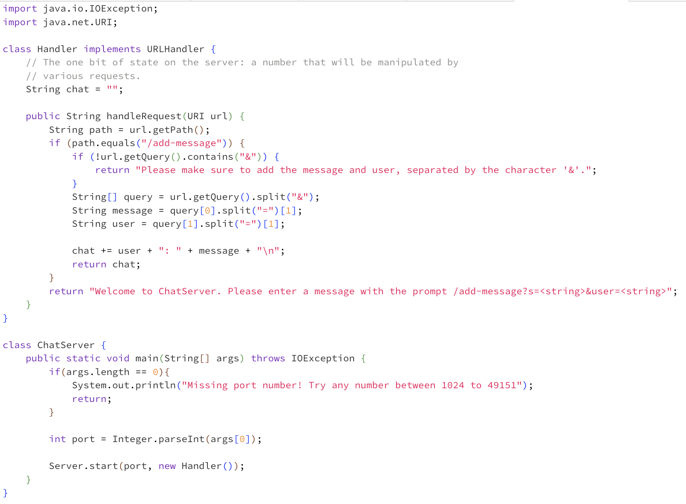

# Katy's CSE15L Lab Reports

## Second Lab Report
I wrote a web server called `ChatServer` that takes in message and user arguments and maintains and displays an ongoing chat between users. I also added a `clear` path so that the user can clear the chat if they'd like to.
---
Here is my code for `ChatServer`. Instead of an error message, I changed that to be a corrective prompt for the user. I also added a corrective message in case the user forgets to use an `&` to separate message and user.

### First example of `ChatServer` use:

- Methods called in my code: `main` starts up the server which eventually calls my `handleRequest` method. 
- Relevant args or fields:
  - `chat`, the ongoing `"user: message"` String. It starts with the value of an empty string.
  - `url`, a URI object containing information about the url in our browser. We can use methods like `getQuery()` and `getPath()` to get a String value of the query and path respectively. For reference, `getPath()` would yield `"/add-message"` and `getQuery()` would yield `"s=this+is+my+second+lab+report!&user=kstadler"`. If you look towards the top of the screenshot, you can see these arguments in the browser.
- How do these values change from the request?
  - My handler method will check the path to see whether or not it is `"/add-message"`. In this case, it is, so we separate the query into two parts, for the message and user. We then access the exact string for the message and user by separating those two by the `=` sign. We append the `"user"` + `":"` + `"message"` to the current value of `chat`, and return `chat`. `chat` will end this call with the value `"kstadler: this+is+my+second+lab+report!"`.

---

### Second example of `ChatServer` use:

- Methods called in my code: `handleRequest` is called
- Relevent args or fields:
  - `chat`, the ongoing `"user: message"` String. It currently has the value `"kstadler: this+is+my+second+lab+report"`.
  - `url`, a URI object containing information about the url in our browser. `getPath()` yields `"/add-message"`. `getQuery()` yields `"s=wow+this+looks+like+a+professional+blog.&user=blogReader"`.
- How do these values change from the request?
  - The request adds to our `chat` field, making it `"kstadler: this+is+my+second+lab+report!\nblogReader: wow+this+looks+like+a+professional+blog."`. See the corresponding point above on how I specifically accessed the `user` and `message` String.

---

### SSH Keypairs:
### `ls` and the absolute path to my public key stored on my local system:

### `ls` and the absolute path to the private key stored on the remote `ieng6` system:

### Interaction showing my login to `ieng6` without a password:

### A few sentences on what I learned from Lab 3.
---
## Lab 1
### Example of the `cd` command: 
---

- Working directory: `home`
- When `cd` is used with no arguments (meaning there's nothing after `cd` in the prompt), the user is returned to their home directory. Lack of output isn't an error, since we're changing directories without having to print any output. So when I write the command `pwd`, which prints our working directory, we're shown the path `/home`.

---

- Working directory: `home`
- When we use `cd` with an argument that matches one of our directories, we move into that directory. Again, there's nothing printed after the command executes, but we can see that the prompt has changed on the next line to show that we are now in `lecture1`. Again, when I use `pwd`, `/home/lecture1` prints, showing us that we have moved into `lecture1`.
  
---

- Working directory: `lecture1`
- When we use `cd` with an argument that matches one of our files or a path to one of our files, we see an error message: `messages/en-us.txt: Not a directory`. This is because the `cd` command is meant for the user to navigate through directories, and it's impossible to "navigate through" a file. 

---
### Example of the `ls` command:
---

- Working directory: `lecture1`
- When I type in `ls` with no arguments, that means the files in our current working directory will be listed as output. Indeed, we can see 4 files and/or directories listed, separated by spaces. `messages` is bold and in blue, which is Edstem's way of distinguishing a directory.
  
---

- Working directory: `home`
- Typing `ls` with a argument matching a directory/path to a directory results in the files in that directory being printed. In the example above, I provided `lecture1/messages`, which was the path (relative to my working directory, home) to the directory `messages`. Output was as expected: 4 language files are listed.

---

- Working directory: `home`
- `ls` with a file argument results in the file's path, relative to our working directory, being printed. This isn't an error because, though we normally use `ls` to display files within a directory, it's programmed to just output the information it knows about a file if a file is passed in as an argument. In the screenshot above, I give a path to a file and that path is also outputted.

---
### Example of the `cat` command:
---

- Working directory: `home`
- If we use the `cat` command with no arguments, it recognizes that there is no file provided for it to read from, and it reads from `stdin` (the "standard input device") instead. Anything I type after entering `cat`, no args, will just be printed again on the next line after I press enter. To exit the loop of typing, entering, and having what you typed outputted, you can press `control + d`, and we return to the normal prompt.
  
---

- Working directory: `home`
- Using `cat` with a directory argument displays an error message: `cat: lecture1: Is a directory`. There are ways for you to use `cat` to print every file within a directory, but `cat` can't print a directory. The example below shows how `cat` prints the contents of a file.
  
---

- Working directory: `home`
- Using `cat` with a file path argument outputs the contents of that file without risking changing anything in the file. If we open the file `en-us.txt`, we see the contents "Hello World!", and those contents are correctly printed when we use the command `cat lecture1/messages/en-us.txt`.

---

