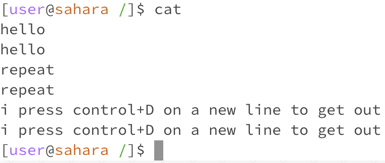

# Katy's CSE15L Lab Reports
## Lab 1
### Example of the `cd` command: 

- Working directory: home
- When cd is used with no arguments (meaning there's nothing after cd in the prompt), the user is returned to their home directory. So when I write the command "pwd", which prints our working directory, we're shown the path /home.

### Example of the ls command:

### Example of the cat command:

blah blah 
*this should be italic*
**this should be bold**
# this is a header
## this is another header
That is so funny! :joy:

