# Katy's CSE15L Lab Reports

## Third Lab Report
Testing, debugging, and command-line.

---

### Part 1: 
There is a bug in the `reverse()` method of the `ArrayExamples` class. The method is supposed to take in an array and return a reversed version of that array. For example, {1, 2, 3} --> {3, 2, 1}.
- Failure inducing input:
    ```
    @Test
    public void testReversedActual() {
        int[] input1 = {1, 2, 3};
        assertArrayEquals(new int[]{3, 2, 1}, ArrayExamples.reversed(input1);
    }
    ```
- An input that does NOT induce failure:
    ```
    @Test
    public void testReversedEmpty() {
        int[] input = { };
        assertArrayEquals(new int[]{ }, ArrayExamples.reversed(input));
    }
    ```
- The symptom: As we can see, there were two tests run: one with the failure inducing input, one without. For the failed test, we can see that `JUnit` expected `3` but found `0` when it started comparing the expected with the actual array. 
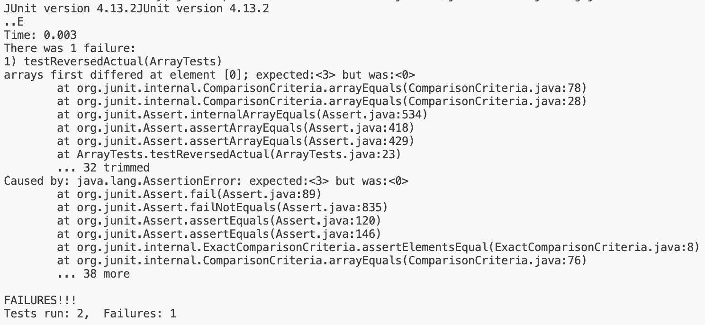
- The buggy code:
```
static int[] reversedWrong(int[] arr) {
    int[] newArray = new int[arr.length];
    for(int i = 0; i < arr.length; i += 1) {
      arr[i] = newArray[arr.length - i - 1];
    }
    return arr;
}
```
- The correct code:
```
static int[] reversed(int[] arr) {
    int[] newArray = new int[arr.length];
    for(int i = 0; i < arr.length; i += 1) {
      newArray[i] = arr[arr.length - i - 1];
    }
    return newArray;
}
```
- Why does this fix work? I changed the buggy code so that instead of copying elements into the given array, `arr`, we copy elements into our `newArray`. Inside the for loop of the buggy code, we're actually copying elements from the `newArray` into the given array, when we want to do the opposite. The `0` found when we expected `3` is helpful because it makes us think about where the `0` came from. It can be a bit of a hint because the default values for an integer array are `0`, so we must be copying from the wrong array. Finally, I make sure we return the `newArray` rather than the old one.

### Part 2: researching a command (grep)
In general, the grep command searches a file/pattern for a given set of characters, then returns the lines that those characters appear on. In general, a use of `grep` could look like: `grep <"stuff to find"> <"file(s)">`. I referenced [geeks for geeks](https://www.geeksforgeeks.org/grep-command-in-unixlinux/) for the different `grep` modifiers, then tinkered around a bit to come up with my specific examples.
#### Some other ways to use grep:
- `grep -l`: display the file names of the lines that match a given pattern
    - **example 1:** search the entire `technical` directory and redirect file names that have lines matching "Democrat" into a file called `files-with-democrat.txt`. Note that this is in the working directory `technical`.
        - command: `grep -l "Democrat" $(find -f .) > files-with-democrat.txt`
        - output: we get a file containing:
        ```
        ./government/Gen_Account_Office/July11-2001_gg00172r.txt
        ./government/Media/Good_guys_reward.txt
        ./government/Media/Barnes_pro_bono.txt
        ./government/Media/predatory_loans.txt
        ./government/Media/Terrorist_Attack.txt
        ./government/Media/Attorney_gives_his_time.txt
        ./government/Media/Weak_economy.txt
        ./government/Media/Barr_sharpening_ax.txt
        ./government/Media/Politician_Practices.txt
        ./911report/chapter-13.5.txt
        ./911report/preface.txt
        ```
        - In this situation, the `grep` command, because we provided the `-l` modifier, displays the file names of line matches to "Democrat". For the "stuff to look through", we use a parameterized find command, which recursively searches `technical`.
    - **example 2:** search the entire `technical` directory and redirect file names that have lines matching "rna" into a file called `files-with-rna.txt`. Note that this is in the working directory `technical`.
        - command: `grep -l "rna" $(find -f .) > files-with-rna.txt`
        - output: we get a file containing MANY file names, including:
        ```
        ./government/About_LSC/LegalServCorp_v_VelazquezSyllabus.txt
        ./government/About_LSC/Progress_report.txt
        ./government/About_LSC/Strategic_report.txt
        ./government/About_LSC/Comments_on_semiannual.txt
        ./government/About_LSC/Special_report_to_congress.txt
        ./government/About_LSC/CONFIG_STANDARDS.txt
        ./government/About_LSC/commission_report.txt
        ./government/About_LSC/LegalServCorp_v_VelazquezDissent.txt
        ./government/About_LSC/ONTARIO_LEGAL_AID_SERIES.txt
        ./government/About_LSC/LegalServCorp_v_VelazquezOpinion.txt
        ./government/About_LSC/diversity_priorities.txt
        ./government/About_LSC/reporting_system.txt
        ./government/About_LSC/State_Planning_Report.txt
        ./government/About_LSC/Protocol_Regarding_Access.txt
        ./government/About_LSC/ODonnell_et_al_v_LSCdecision.txt
        ./government/About_LSC/conference_highlights.txt
        ./government/Env_Prot_Agen/multi102902.txt
        ```
        - Again, `grep` displays the file names with line matches to "rna", and we redirect the `grep` output into a file. We are using the parameterized find command as we did in the example above. Note here that there are a lot of files in the `government` directory that seem to contain "rna", which is peculiar. Check out the next example for more on this.
- `grep -w`: display the lines that match the whole word of the pattern/string
    - **example 1:** with the example above, we end up with a super long file full of files that have nothing to do with rna. To make sure we are only displaying the file names of files that have "rna", we use the `-w` command to specify that we want "rna" to be the WHOLE word. Hopefully, we'll end up with a shorter, more tailored list of files. Note that this is in the working directory `technical`.
        - command: `grep -lw "rna" $(find -f .) > files-with-onlyrna.txt`
        - output: we get a file with the contents:
            ```
            ./biomed/1471-2164-3-13.txt
            ./biomed/1471-2199-3-17.txt
            ./biomed/1471-2105-3-2.txt
            ./biomed/1471-2148-3-7.txt
            ```
        - The ouptut we get is much shorter, and it makes sense that these files contain "rna"!. Not "external" or "internal", which contain "rna" but make more sense for government files. `grep` searches for "rna" as a whole word and only returns matches for that. We also still use the `-l` modifier to only display file names.
    - **example 2:** search `911report` files for "bill" to see where legislation is being called into play. We want to use `-w` because we don't want to get matches for "billing" or "bills" or "billion", for example. Note that our working directory is `technical`.
        - command: `grep -w "bill" $(find 911report) > bill.txt`
        - output: we get a file with the contents:
        ```
        911report/chapter-13.5.txt:                sequential referral of the annual authorization bill for the national foreign
        911report/chapter-13.5.txt:                the bill passed by the Senate Select Committee on Intelligence before the bill is
        911report/chapter-13.1.txt:            When Congress passes an appropriations bill to allocate money to intelligence
        911report/chapter-13.1.txt:                been introduced, most recently a bill by the chairman of the House Intelligence
        911report/chapter-3.txt:                its efforts on a "passenger bill of rights," to improve capacity, efficiency, and
        911report/chapter-3.txt:                periodically killing them. He was also constrained by a bill he signed into law that
        911report/chapter-3.txt:                authorization bill. Indeed, rather than increasing the DCI's authorities over
        911report/chapter-5.txt:            In short, they fit the bill for Bin Ladin, Atef, and KSM.
        ```
        - Here, we did not use the `-l` modifier, so our output also has the actual line that matches, not just the name of the file. We used a parameterized `find` command that recursively searched the `911report` as the second argument for `grep`.
- `grep -c`: display the number of lines that match a given string/pattern
    - **example 1:** get an idea of how many times Bill Clinton is mentioned in the `911report`. Note that our working directory is `technical`.
        - command: `grep -c "Bill" $(find 911report)`
        - output:
        ```
        grep: 911report: Is a directory
        911report/chapter-13.4.txt:1
        911report/chapter-13.5.txt:1
        911report/chapter-13.1.txt:0
        911report/chapter-13.2.txt:2
        911report/chapter-13.3.txt:2
        911report/chapter-3.txt:4
        911report/chapter-2.txt:0
        911report/chapter-1.txt:0
        911report/chapter-5.txt:0
        911report/chapter-6.txt:1
        911report/chapter-7.txt:0
        911report/chapter-9.txt:0
        911report/chapter-8.txt:0
        911report/preface.txt:0
        911report/chapter-12.txt:0
        911report/chapter-10.txt:0
        911report/chapter-11.txt:1
        ```
        - `grep` looks for line matches for "Bill" in the `911report` directory, then displays each file and the "Bill" count for that file. We can see that Bill Clinton will probably be mentioned most in Chapter 3 of the report. Plus, if we're looking to find information about Bill Clinton, we know not to look at Chapter 7, 8, 9, etc.
    - **example 2:** check the `government` `Alcohol_Problems` for any mentions of addiction, to get an idea of which session talked the most about addiction. Write to a file called `addict-mentions.txt` for easier viewing. Note that our working directory is `technical`.
        - command: `grep -c "addict" $(find government/Alcohol_Problems) > addict-mentions.txt`
        - output: a file containing:
        ```
        government/Alcohol_Problems/Session2-PDF.txt:6
        government/Alcohol_Problems/Session3-PDF.txt:8
        government/Alcohol_Problems/DraftRecom-PDF.txt:2
        government/Alcohol_Problems/Session4-PDF.txt:11
        ```
        - `grep` searches `Alcohol_Problems` recursively for "addict" and returns the files and line match count. We can see that session 4 mentions addiction the most (assuming there's an even spread of mentions across lines), though all of them mention it a fair amount. This can also give us an overall idea of entertwined alcoholism and addiction are in these government documents. 
- `grep -f`: take input from lines in a file and display matches
    - **example 1:** pull from a file called `parties.txt`, containing a list of government parties (Democrat, Republican, Independent), and search the `government` directory for party. For easier viewing, I directed this to a file called `gov-party.txt`. Note that the working directory is `technical`.
        - command: `grep -f parties.txt $(find government) > gov-party.txt`
        - output: we get a file with the contents:
        ```
        government/About_LSC/State_Planning_Report.txt:Independent Evaluation of Delivery System. Florida, Ohio,
        government/Gen_Account_Office/July11-2001_gg00172r.txt:Democratic Member, Subcommittee on Economic Development, Public
        government/Gen_Account_Office/July11-2001_gg00172r.txt:Independent Project
        government/Gen_Account_Office/d03419sp.txt:Independent committees of the board of directors, such as the
        government/Gen_Account_Office/Letter_Walkeraug17let.txt:Republican Ranking Minority Member of the House Committee on
        government/Gen_Account_Office/im814.txt:Verification and validation performed by anIndependent
        government/Gen_Account_Office/ai9868.txt:Practice 6: Provide the Central Group Ready and Independent
        government/Gen_Account_Office/May1998_ai98068.txt:Practice 6: Provide the Central Group Ready and Independent
        government/Media/Good_guys_reward.txt:and the Democratic Party.
        government/Media/Barnes_pro_bono.txt:Dent, who served as spokesman for Democratic Gov. Zell Miller in
        government/Media/predatory_loans.txt:Linkhart, a Denver Democrat, introduced the bill at the behest
        government/Media/predatory_loans.txt:Senate but foresees trouble in the Republican-controlled House.
        government/Media/FY_04_Budget_Outlook.txt:Republicans cut the organization's budget deeply in 1996, but
        government/Media/Terrorist_Attack.txt:Republican-controlled Congress prohibited lawyers receiving federal
        government/Media/Terrorist_Attack.txt:inaugurated by President Clinton and some other Democrats. But even
        government/Media/Poverty_Lawyers.txt:Schwartz, a law-and-order Republican on the Council of the District
        government/Media/Poverty_Lawyers.txt:"They try to see her as less of a Republican," said Ms. Schwartz
        government/Media/Self-Help_Website.txt:Pryce, a Republican from Upper Arlington.
        government/Media/Civil_Matters.txt:Naples Republicans Dudley Goodlette in the House and Burt
        government/Media/Attorney_gives_his_time.txt:Tallahassee Democrat
        government/Media/Weak_economy.txt:Busch, an Anne Arundel County Democrat.
        government/Media/Weak_economy.txt:Mike Miller, a Prince George's County Democrat. "I do believe the
        government/Media/Barr_sharpening_ax.txt:conservative Republican congressman from Georgia, is asking
        government/Media/Barr_sharpening_ax.txt:Since 1994, when Republicans took over as the majority party in
        government/Media/Barr_sharpening_ax.txt:A House Democratic staffer close to the case said that GAO
        government/Media/Politician_Practices.txt:governor. Democrat Roy Barnes was upset in November by Sonny
        ```
        - `grep` uses each line in `parties.txt` as "the thing to search for" and displays the file and line that matches the inputs. This is useful if we're not sure which parties we want to search for, or if we want to change it for the future, or if there are a ton of different parties we want to look for.
    - **example 2:** Check the `plos` directory for a list of different researchers and display the file name and line in a file called `researcher-mentions.txt`. Our list of different researchers comes from the file `researchers.txt`, which contains:
    ```
    Hamilton
    Eisen
    Gibson
    Wagner
    Clarke
    Holloway
    ```
        - command: `grep -f researchers.txt $(find plos) > researcher-mention.txt`
        - output: a file containing:
        ```
        plos/journal.pbio.0020183.txt:        sexual biology. With William Hamilton, Hurst came up an explanation for this apparent
        plos/journal.pbio.0020183.txt:        rapidly, Hurst and Hamilton showed. A nuclear gene that enforces uniparental inheritance of
        plos/journal.pbio.0020019.txt:        it is acting (Gibson and Wagner 2000). However, canalization also reduces the effects of
        plos/journal.pbio.0030050.txt:        Paleoanthropologist Ralph Holloway (Columbia University, New York, United States) uses
        plos/journal.pbio.0030050.txt:        Holloway explains. Endocasts are particularly useful for comparing brain sizes, but they
        plos/journal.pbio.0030050.txt:        appeared. These often reflect cerebral specialisation, and Holloway believes that some of
        plos/journal.pbio.0030050.txt:        Indeed, says Holloway, the reorganisation of the brain during evolution has been at least
        plos/journal.pbio.0030050.txt:        Holloway work on the raw material of random gene mutations, and molecular biologists now
        plos/journal.pbio.0020043.txt:        such tool is W. D. Hamilton's (1964a) theory of inclusive fitness, which holds that the
        plos/journal.pbio.0020043.txt:        genetic relatedness. But the rise of Hamiltonian thinking coincided with the eclipse of
        plos/journal.pbio.0020043.txt:          Hamilton (1964b) pointed out that this high relatedness can explain the high level of
        plos/journal.pbio.0020133.txt:        silenced target genes in transgenic plants (Hamilton and Baulcombe 1999). They proposed
        plos/pmed.0010046.txt:        PLoS Medicine , Mike Clarke, the director of the United Kingdom Cochrane
        plos/pmed.0010046.txt:        response to Clarke's challenge is that it will remain difficult for researchers,
        plos/pmed.0010046.txt:        Returning to Clarke's challenge, our final response is to say that we have a bold vision
        plos/journal.pbio.0020406.txt:        availability in the region today (Clarke 2003).
        plos/journal.pbio.0020406.txt:        constraints (Clarke and Johnston 2003). However, it remains remarkable that even simple
        plos/journal.pbio.0020215.txt:        epithelium (Cho et al. 2000; Gibson and Schubiger 2000). Furthermore, in the wing imaginal
        plos/journal.pbio.0020439.txt:          (Rai and Eisenberg 2003).
        plos/journal.pbio.0020148.txt:        Francis Hamilton, the Briton who first described zebrafish (
        plos/journal.pbio.0020148.txt:        neurobiologist Judith Eisen (University of Oregon, Eugene, Oregon, United States), ‘who
        plos/journal.pbio.0020148.txt:        Eisen, who now heads her own research group, went to Oregon in 1983 to work on 
        plos/journal.pbio.0020148.txt:        experiments’, Eisen enthuses, ‘and development is quick but not too quick’. Being able to
        plos/journal.pbio.0020148.txt:        for Eisen and other neurobiologists.
        plos/journal.pbio.0020148.txt:        The properties of zebrafish that attracted Eisen soon attracted people interested in
        plos/journal.pbio.0020148.txt:        other aspects of vertebrate development to the stripy tiddler (Figure 1). As Eisen
        plos/journal.pbio.0020148.txt:        Wilson's own interest is in neuroanatomy. Together with Jon Clarke, another
        ```
        - `grep -f` is useful because we don't have to manually type in each researcher's name we want to look for. We can also change the list whenever we want and quickly search again.

  


## Second Lab Report
I wrote a web server called `ChatServer` that takes in message and user arguments and maintains and displays an ongoing chat between users. I also added a `clear` path so that the user can clear the chat if they'd like to.
---
Here is my code for `ChatServer`. Instead of an error message, I changed that to be a corrective prompt for the user. I also added a corrective message in case the user forgets to use an `&` to separate message and user.


### First example of `ChatServer` use:
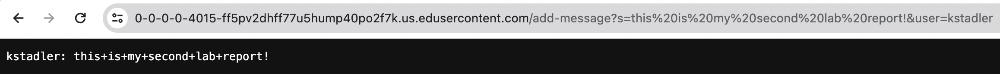
- Methods called in my code: `main` starts up the server which eventually calls my `handleRequest` method. 
- Relevant args or fields:
  - `chat`, the ongoing `"user: message"` String. It starts with the value of an empty string.
  - `url`, a URI object containing information about the url in our browser. We can use methods like `getQuery()` and `getPath()` to get a String value of the query and path respectively. For reference, `getPath()` would yield `"/add-message"` and `getQuery()` would yield `"s=this+is+my+second+lab+report!&user=kstadler"`. If you look towards the top of the screenshot, you can see these arguments in the browser.
- How do these values change from the request?
  - My handler method will check the path to see whether or not it is `"/add-message"`. In this case, it is, so we separate the query into two parts, for the message and user. We then access the exact string for the message and user by separating those two by the `=` sign. We append the `"user"` + `":"` + `"message"` to the current value of `chat`, and return `chat`. `chat` will end this call with the value `"kstadler: this+is+my+second+lab+report!"`.

---

### Second example of `ChatServer` use:
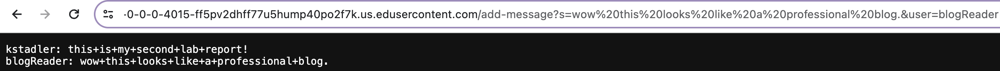
- Methods called in my code: `handleRequest` is called
- Relevent args or fields:
  - `chat`, the ongoing `"user: message"` String. It currently has the value `"kstadler: this+is+my+second+lab+report"`.
  - `url`, a URI object containing information about the url in our browser. `getPath()` yields `"/add-message"`. `getQuery()` yields `"s=wow+this+looks+like+a+professional+blog.&user=blogReader"`.
- How do these values change from the request?
  - The request adds to our `chat` field, making it `"kstadler: this+is+my+second+lab+report!\nblogReader: wow+this+looks+like+a+professional+blog."`. See the corresponding point above on how I specifically accessed the `user` and `message` String.

---

### SSH Keypairs:
### `ls` and the absolute path to my public key stored on my local system:
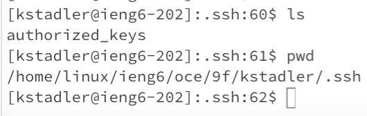

### `ls` and the absolute path to the private key stored on the remote `ieng6` system:
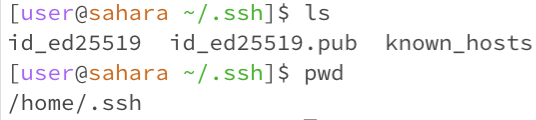

### Interaction showing my login to `ieng6` without a password:
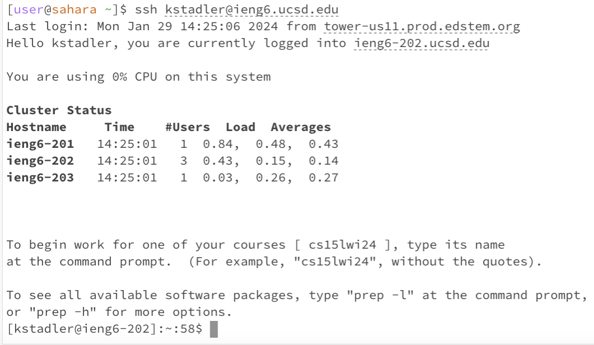

### A few sentences on what I learned from Lab 2 & 3.
Before labs 2 and 3, I didn't know anything about servers or accessing remote systems from my local computer. I really enjoyed looking at the code for the servers and seeing the things we wrote in the Edstem environment pop up on my browser. I'd heard of the term `ssh` before, but it seemed foreign, unknown, and intimidating. Now, I have learned how to log into a remote system, `ieng6`, and that I can use the terminal to move around that system just as I can with my own. I have also learned that I can host a server on that system, then access it on my local machine. I even learned how to generate a specific key and store it in the remote system so that there is a key pair between my computer and the remote system, allowing me to log in to ieng6 without a password.

---
## Lab 1
### Example of the `cd` command: 
---
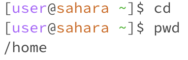
- Working directory: `home`
- When `cd` is used with no arguments (meaning there's nothing after `cd` in the prompt), the user is returned to their home directory. Lack of output isn't an error, since we're changing directories without having to print any output. So when I write the command `pwd`, which prints our working directory, we're shown the path `/home`.

---

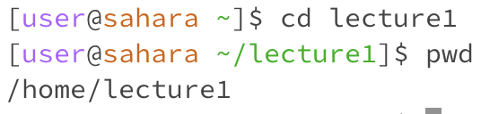
- Working directory: `home`
- When we use `cd` with an argument that matches one of our directories, we move into that directory. Again, there's nothing printed after the command executes, but we can see that the prompt has changed on the next line to show that we are now in `lecture1`. Again, when I use `pwd`, `/home/lecture1` prints, showing us that we have moved into `lecture1`.
  
---

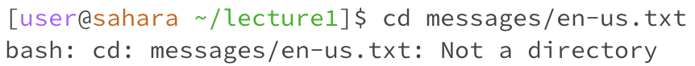
- Working directory: `lecture1`
- When we use `cd` with an argument that matches one of our files or a path to one of our files, we see an error message: `messages/en-us.txt: Not a directory`. This is because the `cd` command is meant for the user to navigate through directories, and it's impossible to "navigate through" a file. 

---
### Example of the `ls` command:
---
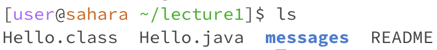
- Working directory: `lecture1`
- When I type in `ls` with no arguments, that means the files in our current working directory will be listed as output. Indeed, we can see 4 files and/or directories listed, separated by spaces. `messages` is bold and in blue, which is Edstem's way of distinguishing a directory.
  
---
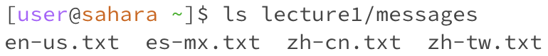
- Working directory: `home`
- Typing `ls` with a argument matching a directory/path to a directory results in the files in that directory being printed. In the example above, I provided `lecture1/messages`, which was the path (relative to my working directory, home) to the directory `messages`. Output was as expected: 4 language files are listed.

---
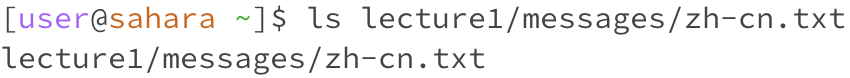
- Working directory: `home`
- `ls` with a file argument results in the file's path, relative to our working directory, being printed. This isn't an error because, though we normally use `ls` to display files within a directory, it's programmed to just output the information it knows about a file if a file is passed in as an argument. In the screenshot above, I give a path to a file and that path is also outputted.

---
### Example of the `cat` command:
---
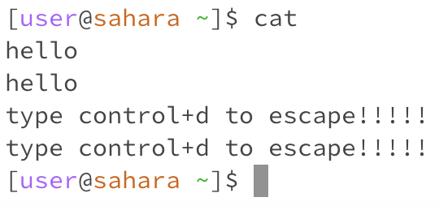
- Working directory: `home`
- If we use the `cat` command with no arguments, it recognizes that there is no file provided for it to read from, and it reads from `stdin` (the "standard input device") instead. Anything I type after entering `cat`, no args, will just be printed again on the next line after I press enter. To exit the loop of typing, entering, and having what you typed outputted, you can press `control + d`, and we return to the normal prompt.
  
---
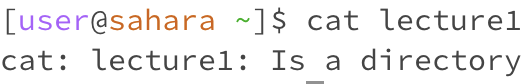
- Working directory: `home`
- Using `cat` with a directory argument displays an error message: `cat: lecture1: Is a directory`. There are ways for you to use `cat` to print every file within a directory, but `cat` can't print a directory. The example below shows how `cat` prints the contents of a file.
  
---
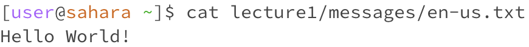
- Working directory: `home`
- Using `cat` with a file path argument outputs the contents of that file without risking changing anything in the file. If we open the file `en-us.txt`, we see the contents "Hello World!", and those contents are correctly printed when we use the command `cat lecture1/messages/en-us.txt`.

---


